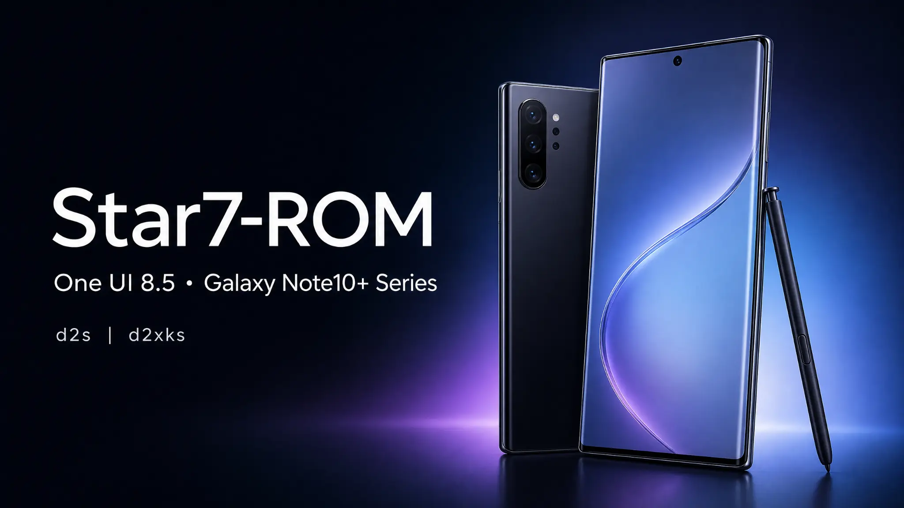

<h1 align="center">
  
</h1>
<p align="center">
  <a href="https://github.com/samsunggithub/oneui8.5-lab/blob/main/LICENSE"></a>
  <a href="https://github.com/samsunggithub/oneui8.5-lab/graphs/contributors"></a>
</p>
<p align="center"><strong>Star7-ROM</strong> is a work-in-progress One UI porting project for Samsung Galaxy Note series devices.</p>

## Project scope

Star7-ROM uses the [UN1CA](https://github.com/salvogiangri/UN1CA) build system as its project and build-framework foundation. UN1CA supplies the firmware acquisition, extraction, patch-application, and flashable-package workflow used by this branch. This laboratory branch uses the Galaxy S24 FE source-firmware configuration (`SM-S721B/EUX`) as its current One UI 8.5 base.

## Upstream lineage and porting references

The current Galaxy Note10+ porting work in this branch primarily derives from the device-focused project lineage, target-side configuration references, patch organization, and porting experience of [EternityROM fifteen][2] and [ExtremeROM fifteen][3]. UN1CA remains the build-system base, while these two projects are the principal references for the Exynos Note10+ adaptation itself.

| Project | Role in this branch |
|---|---|
| [UN1CA][1] | Parent build system and firmware-to-package workflow. |
| [EternityROM fifteen][2] | Primary Galaxy Note10-series (Exynos) porting reference, including target-device configuration and patching approach. |
| [ExtremeROM fifteen][3] | Historical project foundation and major reference for the porting structure, device adaptation practices, and upstream project lineage. |

> **Attribution notice:** these projects are credited as upstream references for this branch. Their respective authors, licenses, and repository terms remain applicable; this attribution does not imply endorsement or active maintenance by their maintainers.

The project direction covers the Samsung Galaxy Note family. Device support is introduced and validated target by target; a roadmap entry is not a compatibility guarantee.

## Current build targets

The `main` branch currently contains configurations and build-matrix entries for the following Exynos Galaxy Note10+ models.

| Device | Codename | Verified model |
|---|---|---|
| Galaxy Note10+ (Exynos) | `d2s` | `SM-N975F` |
| Galaxy Note10+ 5G (Exynos) | `d2xks` | `SM-N976N` |

## Support roadmap

Additional Galaxy Note-series devices will be introduced progressively after their target configuration, partition layout, firmware compatibility, and device-specific patches have been implemented and validated.

> **Current status:** only the two Note10+ targets listed above are configured in this branch. Do not flash a package on a model that is not explicitly listed in the target table or release notes.

## Porting and build approach

Star7-ROM keeps the target-device contract explicit. The build process combines the configured source firmware with target-specific integration for device properties, partition handling, display configuration, framework and application patches, CSC behavior, Bluetooth compatibility, and packaged blobs. For `d2xks`, the static-partition contract and 60 Hz target profile are retained.

## Features and integration

The exact feature set depends on the selected target and source firmware. Where supported by the active device configuration and patches, the project includes:

- Samsung One UI porting through the UN1CA build pipeline.
- Target-specific framework, application, CSC, and compatibility patches.
- Device-aware display and partition handling.
- Bluetooth library compatibility integration.
- AppLock, Knox-related, signature, settings, and system-behavior patches where applicable.
- Flashable release packages generated for the selected target.

# Licensing
This project is licensed under the terms of the [GNU General Public License v3.0](LICENSE). External dependencies might be distributed under a different license, such as:
- [android-tools](https://github.com/nmeum/android-tools), licensed under the [Apache License 2.0](https://github.com/nmeum/android-tools/blob/master/LICENSE)
- [apktool](https://github.com/iBotPeaches/Apktool), licensed under the [Apache License 2.0](https://github.com/iBotPeaches/Apktool/blob/master/LICENSE.md)
- [erofs-utils](https://github.com/sekaiacg/erofs-utils/), dual license ([GPL-2.0](https://github.com/sekaiacg/erofs-utils/blob/dev/LICENSES/GPL-2.0), [Apache-2.0](https://github.com/sekaiacg/erofs-utils/blob/dev/LICENSES/Apache-2.0))
- [img2sdat](https://github.com/xpirt/img2sdat), licensed under the [MIT License](https://github.com/xpirt/img2sdat/blob/master/LICENSE)
- [platform_build](https://android.googlesource.com/platform/build/) (ext4_utils, f2fs_utils, signapk), licensed under the [Apache License 2.0](https://source.android.com/docs/setup/about/licenses)
- [smali](https://github.com/google/smali), [multiple licenses](https://github.com/google/smali/blob/main/third_party/NOTICE)

# Accountability
```cpp
#include <std_disclaimer.h>

/*
* Your warranty is now void.
*
* I am not responsible for bricked devices, dead SD cards,
* thermonuclear war, or you getting fired because the alarm app failed. Please
* do some research if you have any concerns about doing this to your device
* YOU are choosing to make these modifications, and if
* you point the finger at me for messing up your device, I will laugh at you.
*
* I am also not responsible for you getting in trouble for using any of the
* features in this ROM, including but not limited to Call Recording, secure
* flag removal etc.
*/
```

# Credits and acknowledgements

The current Galaxy Note10+ branch is principally informed by [EternityROM fifteen][2] and [ExtremeROM fifteen][3], with UN1CA providing the underlying build system. Their project history, target-device knowledge, patching practices, and technical contributions are acknowledged here alongside the wider contributor community.

- **[salvogiangri](https://github.com/salvogiangri)** for the UN1CA build system, One UI patches, and general project support.
- **[Ocin4Ever](https://github.com/Ocin4ever)** and the [EternityROM project][2] for Galaxy Note10-series porting references, target-side configuration guidance, and patching experience.
- **[ExtremeXT](https://github.com/ExtremeXT)** and the [ExtremeROM project][3] for the historical project foundation, device-porting structure, and engineering references.

A big thanks also goes to the following contributors in no particular order:
- **[Igor](https://github.com/BotchedRPR)** for getting me into porting, teaching me the basics, and emotional support down the road
- **[Halal Beef](https://github.com/halal-beef)** for lk3rd, testing and misc help
- **[Emad](https://github.com/emadhamid7)** for help with S10-specific fixes
- **[Duhan](https://github.com/duhansysl)** for help with vendor backports, a lot of fixes and advice
- **[Anan](https://github.com/ananjaser1211)** for all of his contributions to OneUI porting
- **[PeterKnecht93](https://github.com/PeterKnecht93)** for help with smali and a lot of misc fixes
- **[tsn](https://github.com/tisenu100)** for some smali fixes and advice
- **[Nguyen Long](https://github.com/LumiPlayground)** for misc fixes and support
- **[AlexFurina](https://github.com/AlexFurina)** for S10 specific fixes
- **[Luphaestus](https://github.com/Luphaestus)** for Note 20 specific fixes
- **[Yagzie](https://github.com/Yagzie)** for engmode and misc fixes
- **[Fred](https://github.com/xfwdrev)** for WFD, HDR10+, audiopolicy and more fixes
- **[Saad](https://github.com/saadelasfur)** for help with build system
- **[Vince](https://github.com/borbelyvince)** for help with kernel upstream
- **Nhat Vo** for Google Telemetry app removal
- **[Code Malaya](https://github.com/jomiejoshiro)** for SPen Air Actions
- **[Renox](https://github.com/renoxtv)** for overlay patches and testing
- **[Ksawlii](https://github.com/Ksawlii)** for updating the build system and FOD animation patch
- **[nalz0](https://github.com/nalz0)** for Multi-User support
- **[EndaDwagon](https://github.com/EndaDwagon)** for extensive wiki development and documentation work
- **[Oskar](https://github.com/osrott61-gh)** for Odinpacks, Building before we started using CI, Wiki
- **[Mesazane](https://github.com/Mesazane)** for Building before we started using CI
- **Dupa** for helping me in every way possible, without him this project would be a flop.
- **[RayShocker](https://github.com/RayShocker)** for HRM fix
- **[Szucsy92](https://github.com/Szucsy92)** for SingleTake fix
- **[Kurt](https://github.com/kurtbahartr)** for ASCII art and some minor fixes
- And everyone else who aided in testing, wiki, translations etc!

Original UN1CA credits:
- **[ShaDisNX255](https://github.com/ShaDisNX255)** for his help, time and for his [NcX ROM](https://github.com/ShaDisNX255/NcX_Stock) which inspired this project
- **[DavidArsene](https://github.com/DavidArsene)** for his help and time
- **[paulowesll](https://github.com/paulowesll)** for his help and support
- **[Simon1511](https://github.com/Simon1511)** for his support and some of the device-specific patches
- **[ananjaser1211](https://github.com/ananjaser1211)** for troubleshooting and his time
- **iDrinkCoffee** and **[RisenID](https://github.com/RisenID)** for documentation revisioning
- **[LineageOS Team](https://www.lineageos.org/)** for their original [OTA updater implementation](https://github.com/LineageOS/android_packages_apps_Updater)
- *All the UN1CA project contributors and testers ❤️*

# Target configuration and kernel sources

Target-specific configuration is maintained in [`target/d2s`](target/d2s) and [`target/d2xks`](target/d2xks). Kernel and device-tree source references must be selected for the exact target and release being built; the repository does not claim a single shared kernel source for all planned Galaxy Note-series devices.

## References

[1]: https://github.com/salvogiangri/UN1CA "UN1CA"
[2]: https://github.com/Ocin4ever/EternityROM/tree/fifteen "EternityROM fifteen"
[3]: https://github.com/ExtremeXT/ExtremeROM/tree/fifteen "ExtremeROM fifteen"
